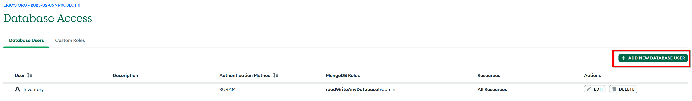
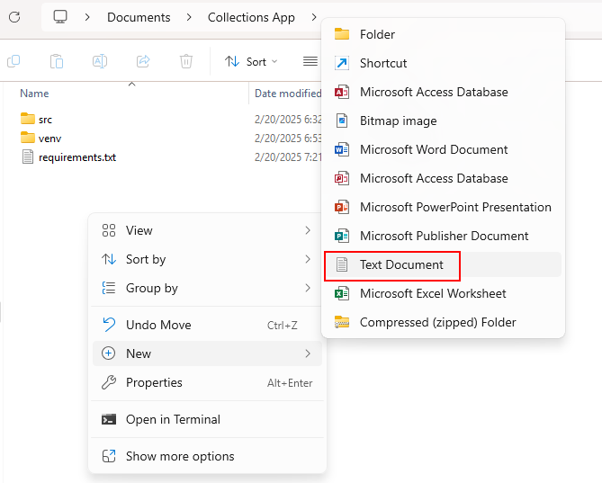
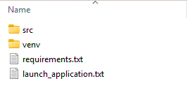
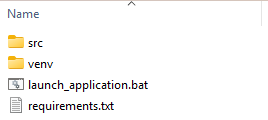
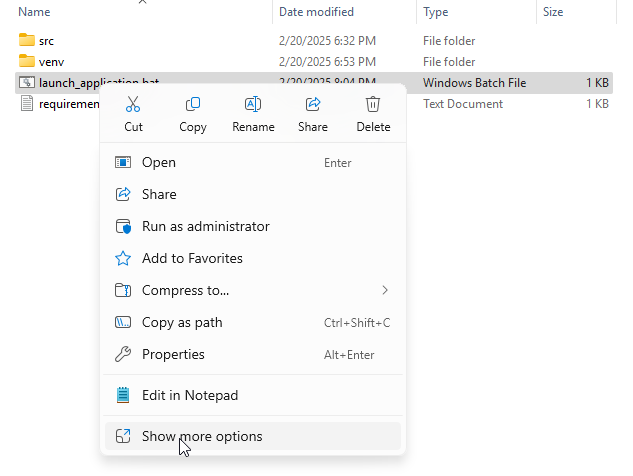
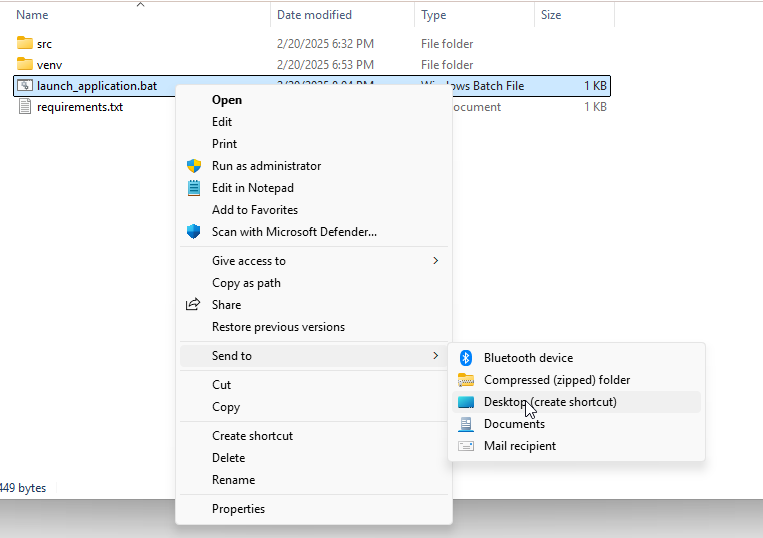
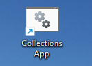

# Setting Up the Application

Now that you've gotten the MongoDB database set up and a Python environment created to run the application in, you can 
start on the last main step - Setting up your local app settings!  These settings will define what MongoDB instance
your app will connect to and with what credentials.  If additional functionality is built out into the app this may 
change to include more configurable settings, so keep an eye out for updates!

## Setting Up a MongoDB User

A good practice for data security when having applications connect to databases is to create a specific account or user
that has as little permissions as possible and is only used by that one application.  This allows for easier auditing of
who is accessing your data and how, as well as helping manage user access.  This section will walk you through how to 
set up an application user in MongoDB and what details you should copy into your application's local `settings.conf`
file.

1. To start, open up a web browser and navigate to your MongoDB instance.  If you're using MongoDB Atlas, you can log
in at [https://cloud.mongodb.com](https://cloud.mongodb.com).  Once you're logged into your account, navigate to the 
project you created and click on it, in this case it would be my `Project 0` link in the screenshot below.


2. Once you're in your project, you'll want to navigate to the `Database Access` tab on the left side of the screen.
This is where you can manage the users that have access to your database.  Click on the `Add New Database User` button.



3. In the new user screen that pops up, you'll want to fill in username, a password, and a description for the user, as
shown in the first screenshot below.  Make sure to record the password you're using somewhere safe since you'll need it
later in this setup process.  Once you've filled in the details, scroll down on that page to find the permissions 
section.


4. In the permissions section, you'll want to click the `Add Built-In Role` button and then in the dropdown that 
appears you'll want to select the `Read and write to any database` role.  This will give the user the ability to read
and write to any database within the collections you define.


5. Confirm that you've gotten the password recorded and the user permissions set to `Read and write to any database`, 
and then click on the `Add User` button to create this new user.  You'll be taken back to the `Database Access` tab 
where you can see the new user you've created.  You'll need the username and password you've created for this user when
we set up the application settings to tell it how to connect to MongoDB.


6. You should now see the new user in the Database Access page.  If you don't first try refreshing the page, and then
if there still isn't a user just try this process again, you might have clicked the `Cancel` button by accident (I did 
that twice trying to put this together).  Once you see the user, you're ready to move on to the next step!


## Getting the MongoDB Connection Details

Now that you've created a new user for your application to use, you'll need to get the connection details for your
MongoDB instance.  These details are what make up something called a "connection string" that applications use to 
connect and authenticate with databases.  This section will walk you through how to get the connection string details
from your MongoDB instance.

1. To start, navigate to the `Clusters` tab on the left side of the screen.  This is where you can see the clusters
that you've created and the details about them.  Click on the `Connect` button for the cluster you want to connect to.
**It is important to make a note of the cluster name, in this case `Cluster0`**


2. In the `Connect to Cluster` screen that pops up, you'll want to click on the `Connect your application` button.


3. In the `Connect to Cluster` page that appears, you should make sure the Python version is selected appropriately,
and then you'll want to note the underlined portion of the connection string that appears in the lower portion of the 
page.  I call this value the URI (Uniform Resource Identifier) and it's one of the five values you'll need to copy
into your application's settings file.  Once you have this value recorded, click on Done to close the window.


4. The last value that you're going to need is the Database name that contains your collections.  To get this value,
you'll want to click on the Cluster name in the `Clusters` tab, and then click on the `Collections` tab in the Cluster
summary page.


The value that you want to record here is, in my case, `ExampleDatabase`.  Your database name may be different, so make 
sure you're recording your value and not my example by mistake.

At this point, you should have all the following recorded:

* username
* password
* cluster
* database
* URI

## Setting Up the Local Application Settings

If you open up your application folder, wherever you saved it, you should see a folder named `src`.  Open up that folder
and you should see a file named `settings.EXAMPLE.conf`.  Copy and Paste this file to the same location and rename it to 
just be `settings.conf`.  This file is where you'll put all the details you just recorded from the MongoDB setup steps.

Open up the `settings.conf` file in a text editor of your choice.  You should see a file that looks like the
following:
```conf
[mongo_db]
mongo_username = ""
mongo_password = ""
mongo_cluster = ""
mongo_database = ""
mongo_uri = ""
```

Fill in the values you recorded from the MongoDB setup steps into the `settings.conf` file.  For example, if I were to
fill in the values I recorded from the MongoDB setup steps, my `settings.conf` file would look like the following.
**Please note that the `mongo_cluster` value has a lower-case leading character.  This is done by default in a
connection string for MongoDB.  You can confirm the formatting for yourself by checking the value before the underlined
portion in the connection string screenshot in the prior section.
```conf
[mongo_db]
mongo_username = "DesktopAppUser"
mongo_password = "YourPasswordHere"
mongo_cluster = "cluster0"
mongo_database = "ExampleDatabase"
mongo_uri = "lchdm"
```
 
## Setting Up the Local Launcher File and Shortcut 

So, because Windows is actually surprisingly secure when it comes to running scripts and executables downloaded from
the internet, I've got to walk you through how to set up a launcher file and shortcut to run the application.  This is
not that hard, but it's a bit more involved than just double-clicking the `main.py` file.

Open up Windows File Explorer and navigate to the folder where you saved the application.  In the `src` folder, you'll
want to right-click and create a new text file and name it whatever you'd like.  I named mine `launch_application.txt`
to keep it easy to know what it does.



Open up your new text file in an editor of your choice, copy and paste the code below into the new file, save,
and close the file.  **If you do not use a virtual environment, you can delete the calls to `venv\Scripts\activate`
and `deactivate` as these are virtual environment-specific commands.

```batch
@echo off
setlocal

REM Activate the virtual environment
call venv\Scripts\activate

REM Run the Python application
python src\collections_app.py

REM Capture the exit code of the Python application
set "EXIT_CODE=%ERRORLEVEL%"

REM Deactivate the virtual environment
call deactivate

REM Display the exit code
echo Python application exited with code %EXIT_CODE%.

REM Prompt the user to press Enter to continue
pause

endlocal
```

Once you've got the code above in the new file, right-click on the file in Windows File Explorer again and rename the
file extension (the part after the `.`) to be `.bat`.  You're probably going to get a pop-up warning you that the file 
may become unreadable if you change the file extension but we want to be able to run the file, and you can't run
a text file.You should now see something like this in that the main application folder:


To create something you can run from a double-click-able shortcut on the Desktop, right-click on the `.bat` file.  If 
you see a list of options like the one below, click on the `Show more options` option.


From this option menu, hover over the `Send to` option and select the `Desktop (create shortcut)` option.  This will 
create a shortcut on the Desktop that you can double-click to run the newly-created `.bat` file, which in turn will 
launch the Python application!  You can change the name of the Desktop shortcut to whatever you want, it doesn't impact
what file the shortcut calls.  I renamed mine to be a nice and simple `Collections App`



Go ahead and double click this new shortcut.  If you set up your `settings.conf` file with valid connection details, 
you should see the main application page.  If you haven't set up the `settings.conf` file, the application will return 
an error telling you that you've got to set up settings first.  If you've set up the `settings.conf` file but entered 
one of the values wrong, the application will fail to connect and notify you of that.  Otherwise, your app will launch
and you're good to start exploring!