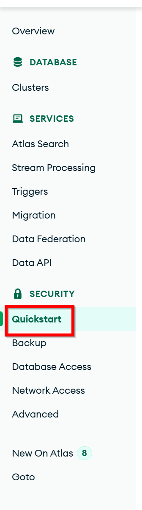
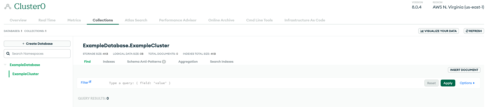

# Getting Started with MongoDB

This section will walk you through setting up a MongoDB account, database, and collections from scratch.
If you already have a MongoDB account and database set up, you can skip this section!

MongoDB does a great job supporting their product, which also means that UI elements and features may change over time.
If something looks different from what is described here, please use your best judgement and try to find the equivalent
feature in the current version of MongoDB.  If free tier options have changed, please let me know, so I can update this!

## Important terminology

MongoDB organizes data, from lowest to highest granularity, in the following hierarchy:

- **Document**: A single record in a collection.  This is the equivalent of a row in a SQL database.
- **Collection**: A group of documents.  This is the equivalent of a table in a SQL database.
- **Database**: A group of collections.  This is the equivalent of a database in a SQL database.
- **Cluster**: A group of databases.  This is the equivalent of a server in a SQL database.

---

## Create a MongoDB Account

1. Go to the [MongoDB registration website](https://www.mongodb.com/cloud/atlas/register).
2. Enter your name, email address, create a strong password, and agree to the terms of service.  Please note that you
will need to verify your email address before you can proceed.

3. Answer the questionnaire about your experience with MongoDB and click "Finish".  This may not be required
for all users.  If you have the option, you should choose "Python" as the primary programming language, "Inventory"
as the type(s) of data, and "Mobile" as the application type.

4. You should now select the "M0" cluster tier.  This is the free tier and should be sufficient for most individual
use cases.  Configure whatever cluster name you want, where it's hosted, and de-select the "Preload sample dataset"
option.  For this walkthrough I have left all values as their default except for unchecking "Preload sample dataset".
When you're satisifed with your selections, click "Create Deployment".

5. Record any information in the pop-up Security Setup window.  This will be important, as it creates a new user with
admin privileges.  If you accidentally clicked off of this page like I did, it's not the end of the world!  We'll now
go over how to configure security settings, how to create a new user with the required permissions, and then finally
how to set up your first database.

## Configure Security Settings

1. In the left navigation menu, click on the "Quickstart" option under the "Security" section.

2. In this section, create a memorable username to use for your applications.  This username will be used to connect to
your database from both this and the optional mobile application.  Once you click "Create User", you should see the 
new user in the list of users and authentication types.

3. Next, scroll down on the page to the "Where would you like to connect from?".  If there are no IP addresses listed,
click on the "Add My Current IP Address" button.  This will allow you to connect to your database from your current
computer.

4. You should also add a custom IP address as shown in the image below if you plan to connect from the mobile
application.  Once you're satisfied with your selections, click "Finish and Close".

## Edit User Permissions

1. In the left navigation menu, click on the "Database Access" option under the "Security" section.  You will likely
only have one or two entries, such as shown in the following image.

2. Click on the "Edit" button for the user you created in the previous section.  This will allow you to change the
permissions for this user.  You should see a screen similar to the following image.  Ensure that the "Built-in Role"
section is set to "Read and write to any database".

3. If you are satisfied with the user configuration, you can move on to the next section and create your database. 
If you want to configure the user to be more secure, you can update the "Built-in Role" to 
"Only read any database".  You will then need to configure settings in the "" section to allow the user to write to 
specific databases.  For this walkthrough, we will leave the user with the "Read and write to any database" role, 
but an example is shown below.

## Create a Database

1. In the left navigation menu, click on the "Clusters" option under the "Database" section.  You should see a screen
similar to the second following image.  You can now click on the cluster name to view additional information about the 
selected cluster.

2. You should now see a screen similar to the one below.  From here, you can see the high-level metrics for your
cluster, such as the number of connections, storage usage, and operations.  This is useful data for monitoring how much
of the free-tier resources you are using.  Click on the "Collections" option in the top menu to view the collections
in your cluster.

3. If you have not loaded any data into your cluster, you should see a screen similar to the one below.  Click on the 
"Add My Own Data" button to create a new database.  You'll then be prompted to enter the database name and collection.
When you click on "Create", you'll then be able to see how MonogDB organizes databases and collections!

## Conclusion

Congratulations!  You now have a free-tier MongoDB account, have configured it with a user, and have created a new 
database.  You can now use this database to store data for your applications, such as the one we will build in the
following sections.  If you have any questions or need help with any of the steps, please let me know on GitHub by 
creating an Issue and describing the problem you're facing.  I'll do my best to help you out!