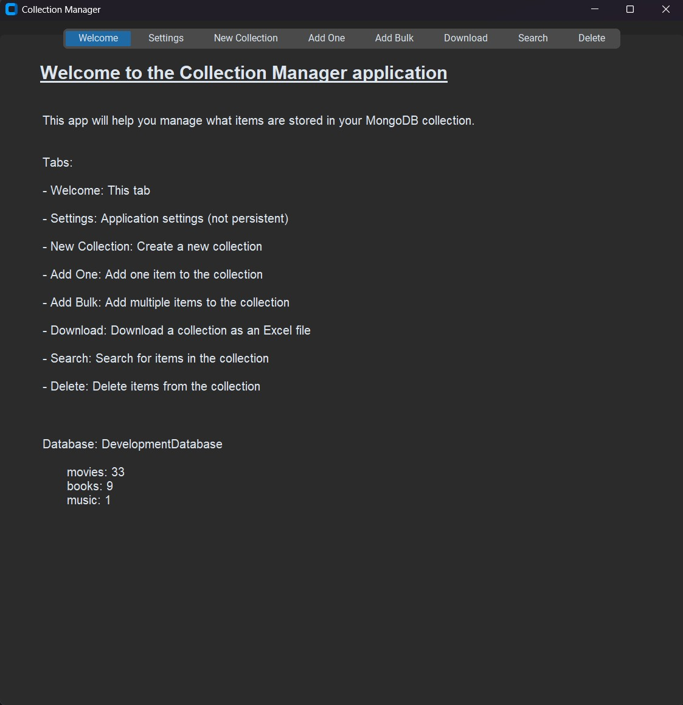

# Application Overview

---

## Summary
This application is designed to help you manage a collection of items.  It is designed to be used with a MongoDB
database and is written in the Python programming language.  The graphical user interface (GUI) is designed to hopefully
be intuitive and easy to use.

If you don't care about the history of the app and only want technical details, those start [here](mongo_setup.md)

## App History
Before we get started, let's go over the problems this app is intended to solve.  Do you have a collection items that
you want to keep track of?  Do you want to be able to easily add, remove, and search for items in your collection?

Have you tried an Excel Spreadsheet?  To be honest, this may be a perfectly suitable solution for you if you
have a small amount of items or only check on the collection items every so often.  I designed this application to
manage my growing collection of books, music (CDs and Vinyl), and movies.  Each of these collections has over 1000
items and I wanted a way to easily search for items, add new items, and remove items that I no longer have.  I started
out using an Excel Spreadsheet, but it quickly became cumbersome to manage, specifically when trying to search on
any mobile interface.

To get around this, I had to find a way to remotely host information about my various collections while also keeping
the data available and easily accessible.  I decided to use MongoDB as my database and Python as my programming language
because MongoDB has a free tier that has a generous amount of storage, and Python since I was already familiar with
developing database applications with it.

## At A Glance
This application can be used in the following ways:

- Create a new collection to store item data in
- Add a new item to a collection you have created
- Add a bunch of items to one or many collections using an Excel file (an example has been provided)
- Download a snapshot of one or all of your collections
- Search for items in a collection
- Delete an item from a collection

This application is designed to be a simple way to manage your collection of items.  It is not designed to be a
replacement for a full-fledged inventory management system.  If you're looking for that then I don't know of any free
offerings, but I'm sure there are plenty of relatively cheap paid options out there!

