# Getting Set Up with Python

This section will walk you through setting up a Python environment from scratch.  If you already have Python 
installed and a virtual environment set up that this application can use, you can skip this section!

## Downloading and Installing Python

This was supposed to be as easy as running a Windows batch file I set up to run the commands to download and install
Python 3.13 for you if it wasn't found on your system, but Microsoft Defender is too good at its job and will block any
such scripts from running if they were downloaded from the internet.  Hopefully these instructions are clear enough, 
but if not please leave an Issue with your hang-ups on the GitHub repo, and I'll try my best to keep the documentation
updated!

1. To get started, navigate to [this link](https://www.python.org/) to download Python.  Please look
for the latest version of the 3.13 version of Python.
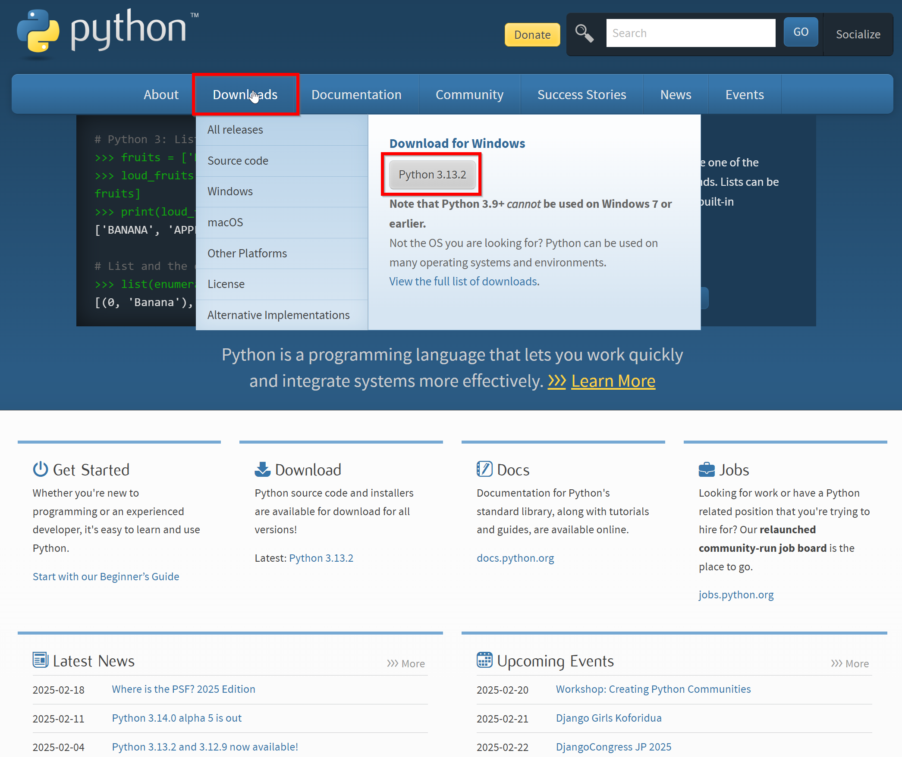
2. Once the installer file finishes downloading, you'll want to run it.  You can do this by double-clicking the file in
your downloads folder, or by clicking the file in your browser if it's still in your downloads bar.
3. When you start the installation process, you should see a window similar to the one below.  The **most** important
part of this installation process is to make sure you've got the `Add python.exe to PATH` selected.  This will make
sure that Windows recognizes your installation of Python as the default.  Once you've double-checked that this box is 
selected, you're good to click on the `Install Now` option.  If you're an advanced user and want to go your own way,
you can click on `Customize installation`, but these instructions assume you just want the default installation.
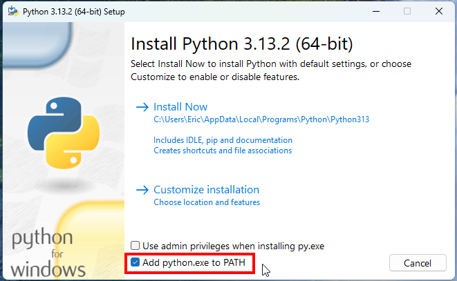
4. Once you click the `Install Now` option, you'll see Python start installing on your system.  This process can take
a few minutes depending on your system, so please be patient.
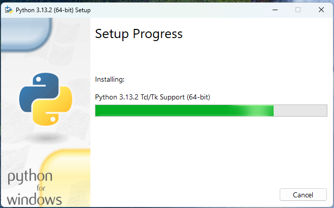
5. Once the installation is complete, you should see a window similar to the one below.  You can click the `Close` 
button to finish the installation process, and you're ready to move on to the next step!  If you plan on installing 
multiple versions of Python or multiple other programming languages, you may wish to click on the
`Disable path lenght limit` option, but this is not necessary for just this application.
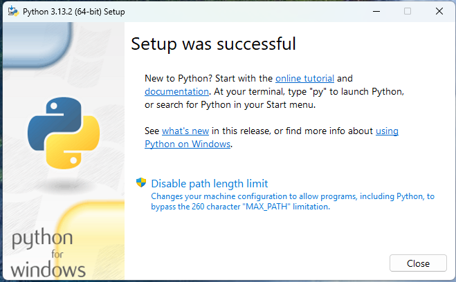

## Verifying Your Installation
The easiest way to verify that Python is installed correctly is to open a new command prompt or Windows Terminal 
instance and type `python --version`.  You can open the command prompt by pressing the `Windows` key and typing `cmd`, 
then pressing `Enter`.  You can open Windows Terminal by pressing the `Windows` key and typing `Terminal`, then
pressing `Enter`.  If you see a version number similar to `Python 3.13.2`, then you're good to go!  If you see an error
message, please uninstall Python and try the installation process again, being sure to follow all the steps laid out
above.

The screenshot below shows how to check for the Python version in Windows Terminal.
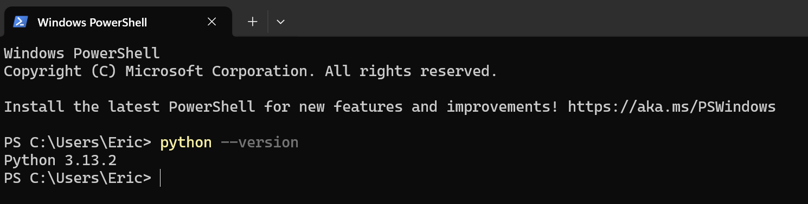

## Downloading & Installing the Application Source Files

1. You will want to have downloaded the latest release from GitHub and have it saved to a location on your system.  From
the [GitHub repo](https://github.com/EricS0110/custom-collections-desktop-app), you'll want to look for the `Releases`
section and click on the `X tags`, where the "X" is just representing that the tag number will be increasing over time. 
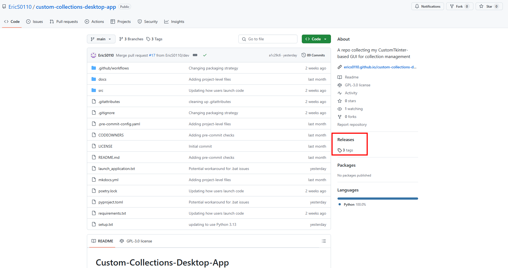

2. The Tags page is automatically sorted by most recent at the top of the page, so locate the top entry and click on 
the `zip` option.  This should download the zipped folder of the required source files to your computer.  If you get 
prompted for where to download the file, you're free to pick wherever you want.  This tutorial assumes you're just
defaulting to the Downloads folder.
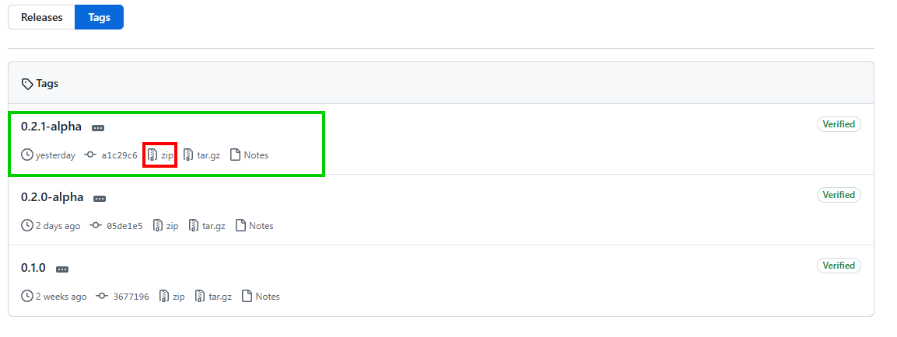

3. Once you've got the downloaded zipped folder, you'll want to extract the contents, and again it's ok to let Windows 
default to wherever it wants, since the default location is right alongside the zipped folder itself!
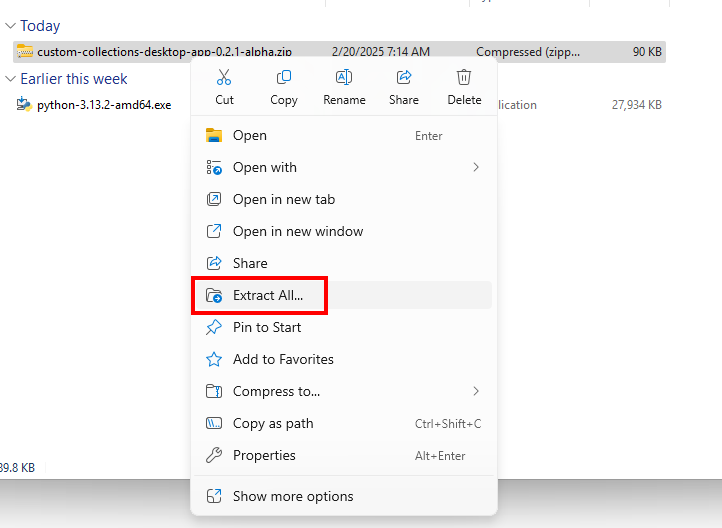
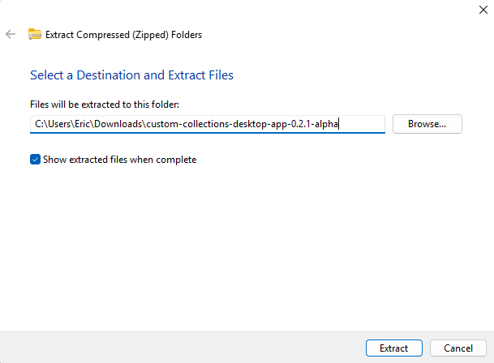

4. Now that you've got the extracted (unzipped) files, you'll want to copy and paste those files into a new directory.
One thing to note is that Windows defaults to extracting the files to a new file of the same name, and GitHub zips the 
original folder in a way that then results in effectively doubling up on the folder names, for example turning 
`example.zip` into `example/example/`.  When you're copying the files, be sure you're copying the "lower" or second 
directory as this is the folder that actually contains the files you need for the application.
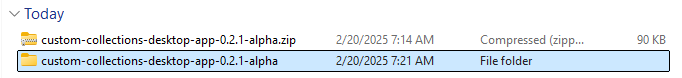
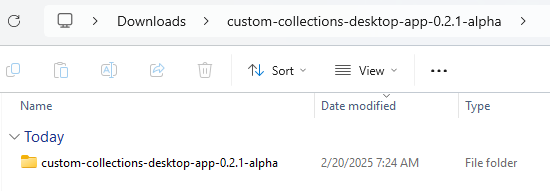

5. Copy this internal extracted folder to where ever you'd like on your computer and rename it to something a little 
more recognizable for you.  In this example, I copied the folder out to `C:\Users\Eric\Documents` and renamed it to 
`Collections App`.  At this point, you can either install the required Python libraries to your base Python installation
or create something called a Virtual Environment to keep the base libraries and the libraries required for this app 
separated.  Personally, I would recommend a Virtual Environment and I have that detailed in the next section.  If you 
don't care and just want to install the libraries to the base Python version, skip the optional section and go to
[the last section](#installing-the-requirements)

## [OPTIONAL] Setting Up a Virtual Environment
If you're planning on using Python for other projects, or you just want to keep your base Python installation only 
containing the default packages, you may want to set up a virtual environment.  This will allow you to install packages
for this application without affecting your base Python installation.  If you're not interested in setting up a virtual
environment, you can skip this step.

1. To set up a virtual environment, you'll need to open a new command prompt or Windows Terminal instance.  The screen
captures for this section are captured from Windows Terminal, but the process is very similar in Command Prompt.
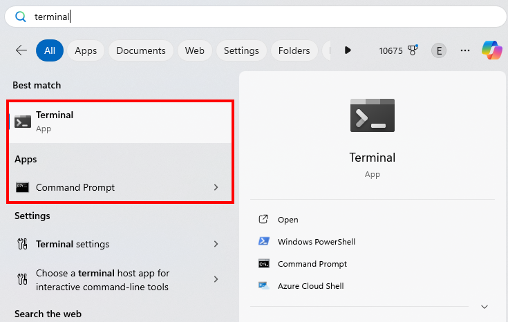
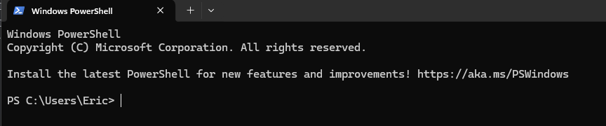

2. To get the virtual environment set up, first you'll want to navigate to the directory you saved the app folder.
Please note that if you have a space in your app folder name, you'll have to specifically use the single-quotes around
the path so that the terminal understands it's all still one continuous path.
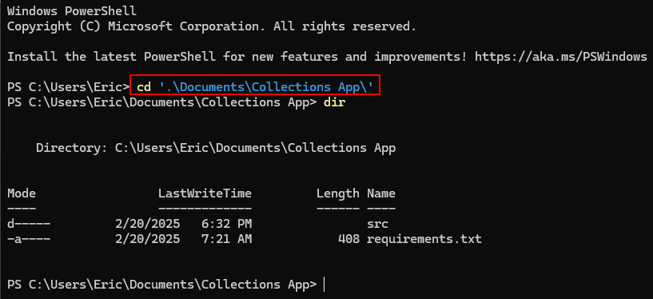

3. Once you're in the application folder, you'll want to run the command `python -m venv venv`.  This may take a second,
so please be patient and don't try and run anything else in the terminal window until you see another line show up for 
user input.  I ran `dir` again to demonstrate that this command adds a new folder named `venv` in your app folder.
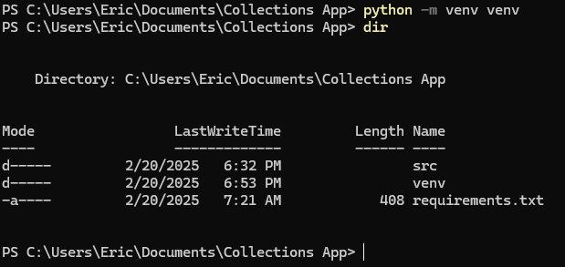

## Installing the Requirements

**If you are working within a virtual environment, please start on step 1 and work through all three steps.  If you are 
working in the base Python environment, you only need to worry about step 2.**

1. With a terminal instance open to the same directory as your venv folder, as shown below, run the command 
`venv\Scripts\activate`.  If you get the error shown below you have two options available to you - the first is to try 
running a similar command from a command prompt window instead of a PowerShell window, or enabling script execution.  I 
would _**STRONGLY**_ recommend just running this from Command Prompt, as enabling PowerShell scripts can be a security
risk.
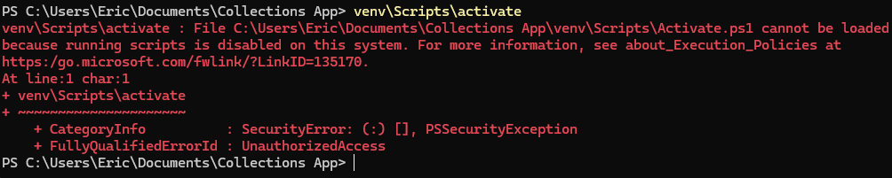
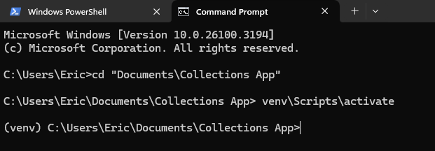

2. To install the required libraries for the app to run, you can now run the command `pip install -r requirements.txt`.
This will read the requirements.txt file saved in this directory and use the pip tool to install them for use in 
Python.  If the command completes successfully, you should see a screen like the one below.  If you get an error, please
create an Issue on GitHub and detail the steps you went through, and I'll try and help you out.
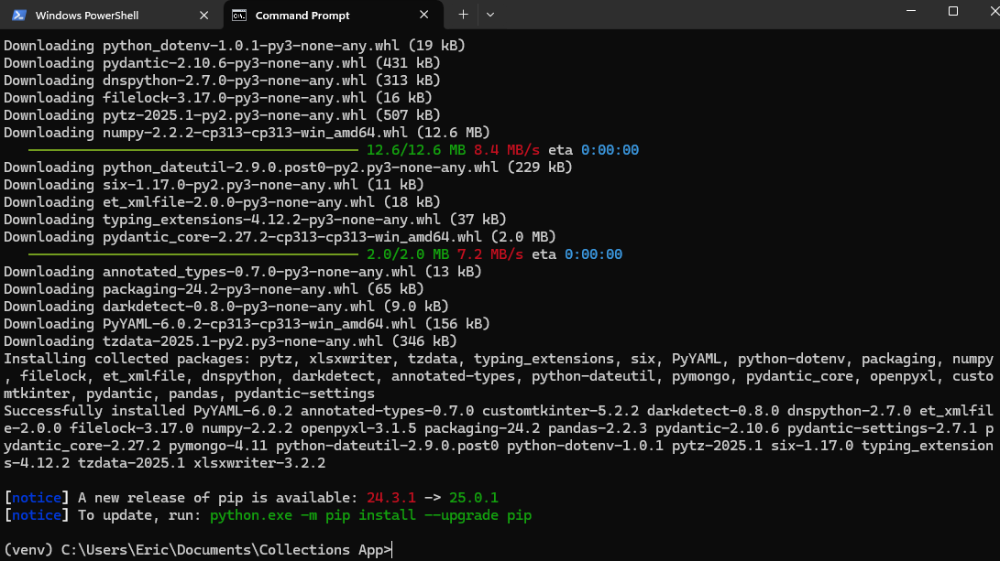
The pip install notice that a new release is available is not an error, just a notice.  If you want to run the command
it tells you to go ahead!  Keeping libraries and tools up to date is important, but keeping pip up to date is not 
required for running this application. 

3. Once you've installed the pip requirements, you should deactivate the virtual environment by running the command: 
`deactivate` in the terminal.  This isn't required, you CAN just close the terminal, but some programmers with multiple
terminal instances open and multiple virtual environments tend to prefer explicitly closing these and they taught me, so
now I'm in that habit and passing it on to you!
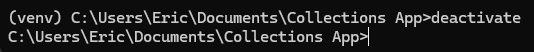